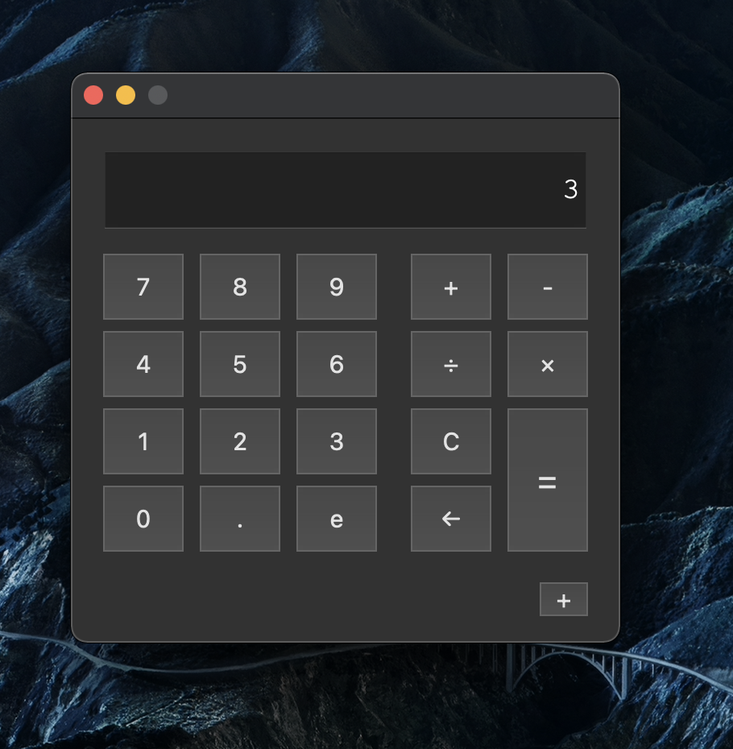
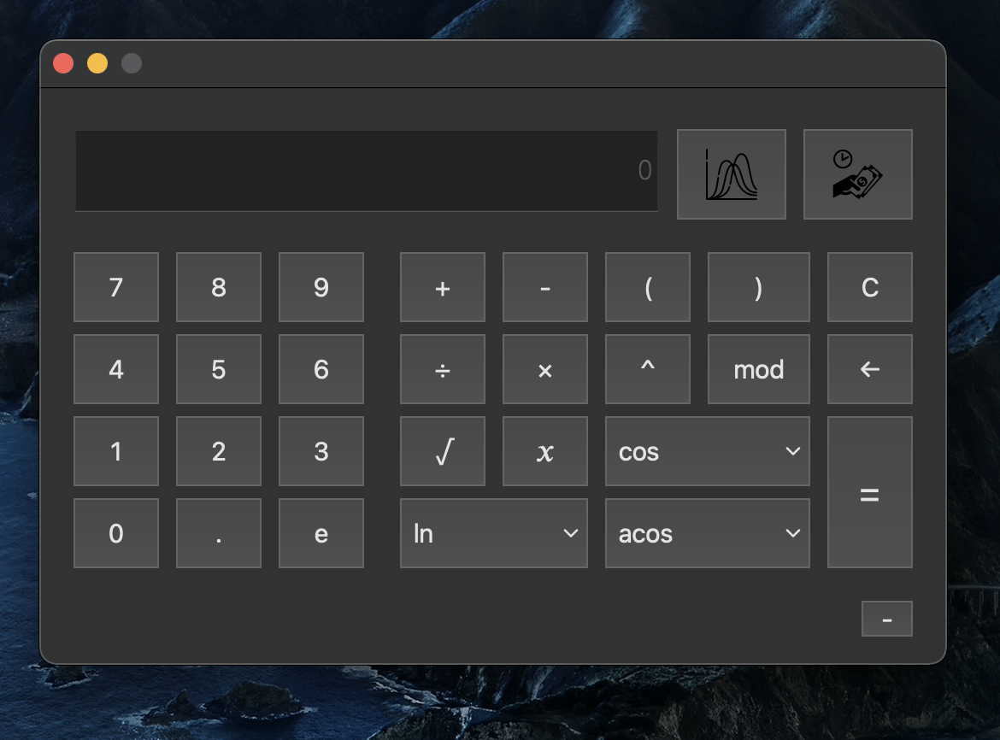

# SMARTCALC
## Description
This is a calculator that can calculate the value of arbitrary expressions.  
SmartCalc supports simple arithmetic operators, as well as functions like `sin`, `acos`, `x^y`.  
SmartCalc is able to plot graphics of any functions that are supported.  
SmartCalc is also able to calculate loans (with list of all payments during all periods).

## How to use the basic functionality

You can type expressions using on-screen buttons, type with your keyboard (some of the functions like `sin` or `cos` don't work that way) or type directly in the input field.  
You can also extend calculator using the `+` button on the bottom-right corner.

This will allow you to use all the available functions of the calculator.  
Functions like `cos`, `acos`, `ln` (with a little triangle on the button) can be changed by clicking with **right mouse button** on them.

Extended calculator also gives you ability to plot graphs of any kind.

If you want to plot a graph of a function, you need to use `x` in the expression as SmartCalc assumes `f(x)=<Your expression>` as a function to plot.  
The graph will re-plot every time you change the expression, automatically. You can also change the low/high **x** and **y** values and change the default precision of the graph if you feel like it is not precise enough (as it uses around *8000 points* to plot the graph by default, and sets **x** minimum and maximum to *-100* and *100* respectivly).
